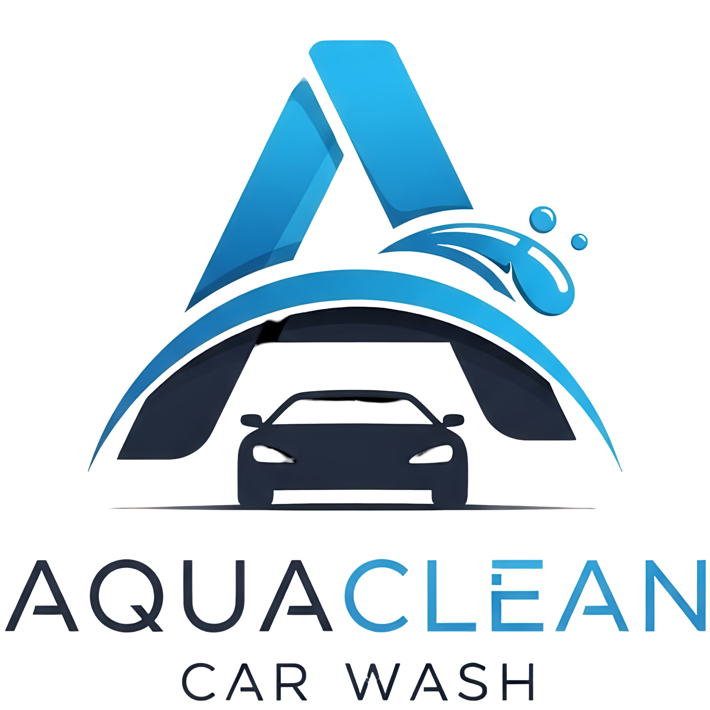

<div align="center">
  
</div>

# AquaClean Car Wash - Plataforma de Gestión y Reservas


Una solución web completa para lavaderos de coches que automatiza las reservas, optimiza la gestión de clientes y potencia el marketing digital. Este proyecto está diseñado para ser una base robusta y reutilizable para negocios del sector.

---

## 🎥 Demo Visual

<!-- TODO: Añadir un GIF animado mostrando el flujo de reserva del cliente y el panel de administración -->
<div align="center">
  *Próximamente: Una demostración visual del producto en acción.*
</div>

---

## ✨ Características Principales

| Característica                          | Descripción                                                                                                                      |
| :-------------------------------------- | :------------------------------------------------------------------------------------------------------------------------------- |
| 📅 **Sistema de Reservas 24/7**         | Permite a los clientes reservar citas online en cualquier momento, seleccionando servicios y empleado de preferencia.            |
| 📊 **Panel de Administración Completo** | Un centro de control para gestionar citas, servicios, horarios, clientes y valoraciones. Incluye un planning visual interactivo. |
| 📱 **Diseño 100% Adaptativo**           | Experiencia de usuario impecable en cualquier dispositivo: móvil, tablet y ordenador.                                            |
| 🔔 **Notificaciones Automáticas**       | Confirmaciones y recordatorios por Email y WhatsApp para reducir las ausencias y mantener a todos informados.                    |
| ⭐ **Sistema de Valoraciones**          | Automatiza la solicitud de reseñas y permite moderarlas antes de mostrarlas públicamente en la web.                              |
| 💳 **Múltiples Vías de Ingreso**        | Soporte para bonos, tarjetas regalo y suscripciones mensuales para fidelizar clientes y generar ingresos recurrentes.            |
| 🔗 **Integraciones Clave**              | Sincronización bidireccional con Google Calendar y pasarela de pagos segura con Stripe.                                          |

---

## 🛠️ Stack Tecnológico

| Área              | Tecnologías                                     |
| :---------------- | :---------------------------------------------- |
| **Frontend**      | React 18, TypeScript, Vite, Mantine UI, Zustand |
| **Backend**       | Node.js, Express.js, TypeScript, Prisma         |
| **Base de Datos** | PostgreSQL                                      |
| **Herramientas**  | pnpm (Monorepo), Git, GitHub, ESLint, Prettier  |

---

## 🚀 Cómo Empezar (Guía para Desarrolladores)

<details>
<summary><strong>Haz clic aquí para ver las instrucciones de instalación y ejecución</strong></summary>

### Requisitos Previos

- Node.js (v20+)
- pnpm (v9+)
- Git
- Una instancia de PostgreSQL en ejecución

### Pasos para la Instalación

1.  **Clonar el repositorio:**

    ```bash
    git clone https://github.com/R3v180/AquaCleanCarWash.git
    cd AquaCleanCarWash
    ```

2.  **Instalar dependencias:**

    ```bash
    pnpm install
    ```

3.  **Configurar variables de entorno:**

    - Habrá un archivo `.env.example` en la carpeta del servidor (`apps/server`).
    - Cópialo a un nuevo archivo llamado `.env` en la misma carpeta.
    - Rellena las variables (credenciales de la base de datos, claves de API, etc.).
      _Nota: Estos archivos se crearán durante el desarrollo del backend._

4.  **Ejecutar las migraciones de la base de datos:**

    ```bash
    # Ejecuta el script 'migrate:dev' solo en el workspace del servidor
    pnpm --filter server run migrate:dev
    ```

5.  **Iniciar los servidores de desarrollo:**
    ```bash
    # Este comando iniciará el frontend y el backend simultáneamente
    pnpm dev
    ```

</details>

---

## 🗺️ Roadmap del Proyecto

Para ver el plan de desarrollo detallado por fases, consulta nuestro archivo [**ROADMAP.md**](./ROADMAP.md).

## 📄 Especificaciones Completas

Toda la funcionalidad del proyecto está documentada en detalle en nuestra [**Especificación de Proyecto**](./docs/PROJECT_SPECIFICATION.md).
